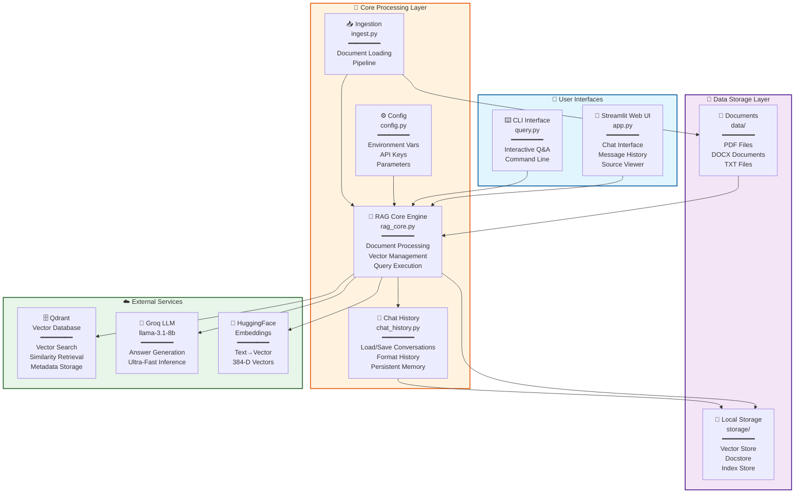
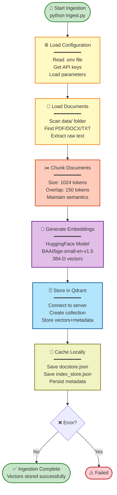
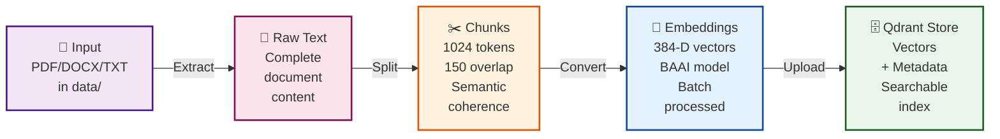
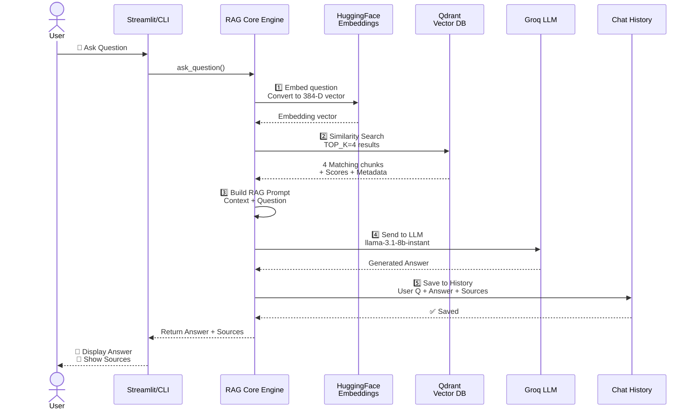

# 🏗️ LlamaIndex + Qdrant RAG System - Architecture & Flow Documentation

## Table of Contents
1. [System Architecture](#system-architecture)
2. [Data Flow Pipelines](#data-flow-pipelines)
3. [Component Overview](#component-overview)
4. [Configuration](#configuration)
5. [Integration Details](#integration-details)

---

## System Architecture

### High-Level Architecture Diagram



---

## Data Flow Pipelines

### Complete System Data Flow Overview

```mermaid
graph TB
    subgraph INGESTION["📥 INGESTION PHASE"]
        USER1["👤 Developer<br/>python ingest.py"]
        INGProcesses["⚙️ Ingestion<br/>Process"]
        USER1 --> INGProcesses
    end
    
    subgraph PROCESSING["🔧 PROCESSING & STORAGE"]
        INGProcesses --> LOAD["📄 Load Documents<br/>from data/"]
        LOAD --> CHUNK["✂️ Split into<br/>Chunks"]
        CHUNK --> EMBED["🧬 Generate<br/>Embeddings"]
        EMBED --> STORE["💾 Store in<br/>Qdrant"]
        STORE --> CACHE["💾 Cache<br/>Locally"]
    end
    
    subgraph QUERY["🤖 QUERY PHASE"]
        USER2["👤 User<br/>Ask Question"]
        QUERYPROCESS["🔄 Query<br/>Processing"]
        USER2 --> QUERYPROCESS
    end
    
    CACHE -.→ QUERYPROCESS
    QUERYPROCESS --> EMB_Q["🧬 Embed<br/>Question"]
    EMB_Q --> SEARCH["🔍 Search<br/>Qdrant"]
    SEARCH --> RETRIEVE["📚 Retrieve<br/>Top 4"]
    RETRIEVE --> BUILD["📝 Build<br/>RAG Prompt"]
    BUILD --> LLM["⚡ Call Groq<br/>LLM"]
    LLM --> ANSWER["✅ Generate<br/>Answer"]
    ANSWER --> SAVE["💾 Save to<br/>History"]
    SAVE --> DISPLAY["🎨 Display<br/>to User"]
    
    style INGESTION fill:#fff3e0,stroke:#e65100,stroke-width:2px
    style PROCESSING fill:#e1f5ff,stroke:#01579b,stroke-width:2px
    style QUERY fill:#f3e5f5,stroke:#4a148c,stroke-width:2px
    style USER1 fill:#ffccbc,stroke:#d84315,stroke-width:2px
    style USER2 fill:#ffccbc,stroke:#d84315,stroke-width:2px
```

### Pipeline 1: Document Ingestion Flow

#### Process Overview
**Purpose**: Load documents from disk, convert to embeddings, and store in vector database

**Trigger**: `python ingest.py`

#### Step-by-Step Flow



#### Data Transformation Pipeline



---

### Pipeline 2: Query & Response Flow

#### Process Overview
**Purpose**: Answer user questions by retrieving relevant documents and generating responses

**Trigger**: User input in Streamlit/CLI interface

#### Query & Response Sequence Diagram



#### Query & Response Processing Flow

```mermaid
flowchart LR
    Q["❓ User Question<br/>What are the<br/>main findings?"]
    
    EMB["🧬 Embedding<br/>━━━━━━<br/>Convert question<br/>to 384-D vector<br/>[0.432, -0.156...]"]
    
    SEARCH["🔍 Vector Search<br/>━━━━━━<br/>Qdrant similarity<br/>TOP_K=4<br/>Cosine similarity"]
    
    RETRIEVED["📚 Retrieved Docs<br/>━━━━━━<br/>4 matching chunks<br/>with metadata<br/>+ confidence scores"]
    
    PROMPT["📄 RAG Prompt<br/>━━━━━━<br/>Context +<br/>Question<br/>Formatted"]
    
    LLM["🤖 LLM Processing<br/>━━━━━━<br/>Groq llama-3.1-8b<br/>Generate answer<br/>using context"]
    
    ANSWER["✅ Answer<br/>━━━━━━<br/>Generated<br/>response<br/>with sources"]
    
    Q -->|HuggingFace| EMB
    EMB -->|Search| SEARCH
    SEARCH -->|Retrieve| RETRIEVED
    RETRIEVED -->|Format| PROMPT
    PROMPT -->|Process| LLM
    LLM -->|Generate| ANSWER
    
    style Q fill:#e3f2fd,stroke:#0d47a1,stroke-width:2px
    style EMB fill:#e1bee7,stroke:#6a1b9a,stroke-width:2px
    style SEARCH fill:#b3e5fc,stroke:#01579b,stroke-width:2px
    style RETRIEVED fill:#c8e6c9,stroke:#2e7d32,stroke-width:2px
    style PROMPT fill:#fff9c4,stroke:#f57f17,stroke-width:2px
    style LLM fill:#ffccbc,stroke:#d84315,stroke-width:2px
    style ANSWER fill:#f8bbd0,stroke:#880e4f,stroke-width:2px
```



#### Example: End-to-End Query Execution

```mermaid
graph TB
    USER["👤 USER INPUT<br/>━━━━━━━━━━<br/>Question:<br/>'What are the main<br/>findings?'"]
    
    EMBED_EXEC["🧬 EMBEDDING STEP<br/>━━━━━━━━━━<br/>Input: 'What are...'<br/>Model: bge-small-en-v1.5<br/>Output: [0.432, -0.156, 0.789, ...]<br/>Dimension: 384"]
    
    SEARCH_EXEC["🔍 SEARCH RESULTS<br/>━━━━━━━━━━<br/>Score 0.92 → study.pdf p.12<br/>Score 0.88 → study.pdf p.13<br/>Score 0.85 → report.pdf p.5<br/>Score 0.81 → summary.txt p.1"]
    
    BUILD_PROMPT["📝 BUILD PROMPT<br/>━━━━━━━━━━<br/>Context: [Top 4 chunks]<br/>Question: [User Q]<br/>Template: QA_TEMPLATE"]
    
    LLM_EXEC["⚡ LLM GENERATION<br/>━━━━━━━━━━<br/>Model: llama-3.1-8b<br/>Process: <1 sec<br/>Output: Answer text"]
    
    ANSWER_OUTPUT["✨ ANSWER<br/>━━━━━━━━━━<br/>'Based on documents...<br/>Main findings are: (1)...<br/>(2)...(3)...'"]
    
    SAVE["💾 SAVE HISTORY<br/>━━━━━━━━━━<br/>Save Q + Answer<br/>+ 4 Sources<br/>to chat_history.json"]
    
    DISPLAY["🎨 DISPLAY<br/>━━━━━━━━━━<br/>Show answer in UI<br/>Display 4 sources<br/>Expandable sections"]
    
    USER --> EMBED_EXEC
    EMBED_EXEC --> SEARCH_EXEC
    SEARCH_EXEC --> BUILD_PROMPT
    BUILD_PROMPT --> LLM_EXEC
    LLM_EXEC --> ANSWER_OUTPUT
    ANSWER_OUTPUT --> SAVE
    SAVE --> DISPLAY
    
    style USER fill:#e3f2fd,stroke:#0d47a1,stroke-width:2px,color:#000
    style EMBED_EXEC fill:#e1bee7,stroke:#6a1b9a,stroke-width:2px
    style SEARCH_EXEC fill:#b3e5fc,stroke:#01579b,stroke-width:2px
    style BUILD_PROMPT fill:#fff9c4,stroke:#f57f17,stroke-width:2px
    style LLM_EXEC fill:#ffccbc,stroke:#d84315,stroke-width:2px
    style ANSWER_OUTPUT fill:#c8e6c9,stroke:#2e7d32,stroke-width:2px
    style SAVE fill:#f0f4c3,stroke:#827717,stroke-width:2px
    style DISPLAY fill:#f8bbd0,stroke:#880e4f,stroke-width:2px
```



---

## Component Overview

### 1. **app.py** - Streamlit Web Interface
**Purpose**: Main user interface for the RAG system

**Key Features**:
- Chat interface using Streamlit chat components
- Session state management for conversation history
- Source reference display in expandable sections
- Clear chat history functionality
- Loading/caching of query engine

**Key Functions**:
- `load_query_engine()`: Cached function to initialize RAG engine
- Display chat messages with role separation
- Render source information (file, page, score, text)
- Handle user input and generate responses

**Flow**:
```
1. Initialize Streamlit page config
2. Load cached query engine
3. Load chat history from file
4. Display all previous messages
5. Show chat input box
6. On user input:
   - Add to session state
   - Display user message
   - Call ask_question()
   - Display assistant response with sources
   - Save to history
```

---

### 2. **query.py** - CLI Query Interface
**Purpose**: Command-line alternative for document querying

**Key Features**:
- Interactive loop for continuous questioning
- Source display in formatted text output
- Chat history management (clear command)
- Exit command handling

**Usage**:
```bash
python query.py
```

**Flow**:
```
1. Load query engine
2. Print instructions
3. Loop until exit:
   - Accept user question
   - Call ask_question()
   - Display answer with sources
   - Show separator line
```

---

### 3. **ingest.py** - Document Ingestion Entry Point
**Purpose**: Orchestrate the document loading and embedding pipeline

**Key Features**:
- Load configuration
- Execute ingestion process
- Display ingestion statistics

**Usage**:
```bash
python ingest.py
```

**Flow**:
```
1. Get config from .env
2. Call ingest_documents()
3. Display total documents loaded
4. Display confirmation message
```

---

### 4. **rag_core.py** - Core RAG Engine
**Purpose**: Central logic for all RAG operations

**Key Components**:

#### A. Setup Functions
```python
setup_llamaindex(config)
  - Configure Groq LLM model
  - Set HuggingFace embedding model
  - Set chunk parameters

get_qdrant_client(config)
  - Create Qdrant client connection
  - Use API key from config
  - Set 60-second timeout

get_vector_store(config)
  - Initialize QdrantVectorStore
  - Reference collection in Qdrant
```

#### B. Document Processing
```python
load_documents(config)
  - Create data/ folder if missing
  - Load all files with SimpleDirectoryReader
  - Parse PDFs, DOCX, TXT files

ingest_documents(config)
  - Load documents
  - Create VectorStoreIndex
  - Store in Qdrant
  - Return count of documents
```

#### C. Query Processing
```python
get_query_engine()
  - Initialize RAG query engine
  - Load from local cache if exists
  - Use query_engine for retrieval

ask_question(question, query_engine, save_history=True)
  - Query with question
  - Get response + source nodes
  - Extract source metadata
  - Save to chat history
  - Return answer + sources
```

#### D. Prompt Template
```
QA_TEMPLATE:
  - System instruction for RAG assistant
  - Context placeholder
  - Question placeholder
  - Instructs to use only provided context
  - Prevents hallucination
```

**RAG Prompt Structure**:
```
You are a helpful RAG assistant.

Use only the context information provided below to answer the user's question.
If the answer is not present in the context, say:
"I don't know based on the uploaded documents."

Do not make up answers.

Context:
---------------------
{context_str}
---------------------

Question:
{query_str}

Answer:
```

---

### 5. **chat_history.py** - Conversation Management
**Purpose**: Manage and persist conversation history

**Key Functions**:

```python
load_chat_history()
  - Read chat_history.json
  - Return list of message dictionaries
  - Format: [{"role": "user/assistant", "content": "...", "sources": []}]

add_message(role, content, sources=None)
  - Append new message to history
  - Save to chat_history.json
  - Maintains chronological order

clear_chat_history()
  - Delete chat_history.json
  - Reset conversation state

get_recent_history(limit=5)
  - Return last N messages
  - Used for context in some prompts

format_history_for_prompt(history)
  - Convert history to prompt format
  - Prepare for LLM context
```

**Chat History Structure**:
```json
[
  {
    "role": "user",
    "content": "What is the document about?"
  },
  {
    "role": "assistant",
    "content": "The document discusses...",
    "sources": [
      {
        "file": "document.pdf",
        "page": 1,
        "score": 0.95,
        "text": "Chapter 1: Introduction..."
      }
    ]
  }
]
```

---

### 6. **config.py** - Configuration Management
**Purpose**: Centralized configuration from environment variables

**Configuration Class**:
```python
@dataclass
class AppConfig:
    GROQ_API_KEY: str          # Groq LLM API key
    GROQ_MODEL: str            # LLM model (default: llama-3.1-8b-instant)
    
    QDRANT_URL: str            # Qdrant server URL
    QDRANT_API_KEY: str        # Qdrant authentication key
    QDRANT_COLLECTION: str     # Collection name (default: llamaindex_rag_documents)
    
    EMBEDDING_MODEL: str       # HuggingFace model (default: BAAI/bge-small-en-v1.5)
    
    DATA_DIR: str              # Input documents folder (default: data)
    CHUNK_SIZE: int            # Document chunk size in tokens (default: 1024)
    CHUNK_OVERLAP: int         # Overlap between chunks (default: 150)
    TOP_K: int                 # Retrieved documents count (default: 4)
    
    RESET_COLLECTION: bool     # Clear Qdrant collection on startup (default: False)
    CHAT_HISTORY_FILE: str     # History file path (default: chat_history.json)
```

**Environment Variables (.env)**:
```
GROQ_API_KEY=your_groq_key
GROQ_MODEL=llama-3.1-8b-instant

QDRANT_URL=http://localhost:6333
QDRANT_API_KEY=your_qdrant_key

EMBEDDING_MODEL=BAAI/bge-small-en-v1.5

DATA_DIR=data
CHUNK_SIZE=1024
CHUNK_OVERLAP=150
TOP_K=4

RESET_COLLECTION=false
CHAT_HISTORY_FILE=chat_history.json
```

---

## Configuration

### Parameter Details

| Parameter | Default | Range | Purpose |
|-----------|---------|-------|---------|
| `CHUNK_SIZE` | 1024 | 256-2048 | Size of text chunks for embedding |
| `CHUNK_OVERLAP` | 150 | 0-500 | Overlap between chunks for context continuity |
| `TOP_K` | 4 | 1-10 | Number of documents to retrieve |
| `EMBEDDING_MODEL` | BAAI/bge-small-en-v1.5 | - | Text-to-vector conversion model |
| `GROQ_MODEL` | llama-3.1-8b-instant | llama-3.1-8b-instant | LLM for answer generation |

### Tuning Guidelines

**For Better Accuracy**:
- Increase `TOP_K` from 4 to 6-8 (more context)
- Increase `CHUNK_SIZE` from 1024 to 1536 (longer context)

**For Better Speed**:
- Decrease `TOP_K` from 4 to 2-3 (fewer retrievals)
- Decrease `CHUNK_SIZE` from 1024 to 512 (smaller chunks)

**For Better Memory Usage**:
- Smaller `CHUNK_SIZE` and `TOP_K`
- Use smaller embedding model

---

## Integration Details

### External Services Required

#### 1. **Groq API** (LLM)
- **Purpose**: Generate answers
- **Model**: llama-3.1-8b-instant (8B parameter model)
- **Speed**: Ultra-fast inference
- **Cost**: Free tier available
- **Setup**: Get API key from https://console.groq.com

#### 2. **Qdrant Vector Database**
- **Purpose**: Store and retrieve document embeddings
- **Features**: Vector similarity search, metadata filtering
- **Options**:
  - Self-hosted: `http://localhost:6333`
  - Cloud: Qdrant cloud (paid)
- **Collection**: llamaindex_rag_documents (auto-created)

#### 3. **HuggingFace Embeddings**
- **Model**: BAAI/bge-small-en-v1.5
- **Purpose**: Convert text to vectors
- **Dimensions**: 384D vectors
- **Speed**: Fast local inference (no API calls)
- **Cost**: Free (runs locally)

---

## File Storage Structure

```
project-root/
├── app.py                          # Streamlit UI
├── query.py                        # CLI interface
├── ingest.py                       # Ingestion entry
├── rag_core.py                     # Core RAG logic
├── chat_history.py                 # History management
├── config.py                       # Configuration
├── requirements.txt                # Dependencies
├── .env                            # Environment variables
│
├── data/                           # Input documents folder
│   ├── document1.pdf
│   ├── document2.docx
│   └── document3.txt
│
├── storage/                        # Local persistence
│   ├── default__vector_store.json  # Vector store metadata
│   ├── docstore.json              # Document store metadata
│   ├── index_store.json           # Index metadata
│   ├── graph_store.json           # Graph metadata
│   ├── image__vector_store.json   # Image vectors (if used)
│   └── chat_history.json          # Conversation history
│
└── .venv/                          # Virtual environment
    └── Scripts/
        └── Activate.ps1           # Activation script
```

---

## Deployment Architecture

```
┌────────────────────────────────────────────────────┐
│         Development / Production Setup             │
└────────────────────────────────────────────────────┘

Option 1: LOCAL DEPLOYMENT
├─ Run Qdrant locally: docker run -p 6333:6333 qdrant/qdrant
├─ Run Streamlit: streamlit run app.py
└─ Use local HuggingFace embeddings (no internet needed)

Option 2: CLOUD DEPLOYMENT
├─ Use Qdrant Cloud (managed)
├─ Deploy Streamlit on: Streamlit Cloud / AWS / GCP
├─ Use Groq API (internet required)
└─ Documents stored in cloud storage: S3 / GCS

Option 3: HYBRID
├─ Qdrant: Cloud managed
├─ App: Local/Cloud
├─ LLM: Groq API (cloud)
├─ Embeddings: Local HF (CPU/GPU)
└─ Documents: Cloud storage
```

---

## Performance Characteristics

| Operation | Time | Notes |
|-----------|------|-------|
| Document Ingestion (100 pages) | 2-5 min | Parallel embedding generation |
| Question Embedding | <100ms | Local HuggingFace model |
| Vector Search (Qdrant) | 10-50ms | K=4, 1000+ documents |
| LLM Response Generation | 1-3 sec | Via Groq API |
| **Total Q&A Latency** | **1.5-4 sec** | End-to-end response time |

---

## Troubleshooting & Common Issues

### Issue: "GROQ_API_KEY is not available"
**Solution**: Add to .env file and reload application

### Issue: "Connection refused to Qdrant"
**Solution**: Start Qdrant server:
```bash
docker run -p 6333:6333 qdrant/qdrant
```

### Issue: Slow responses
**Solution**:
- Reduce `TOP_K` from 4 to 2
- Use smaller `CHUNK_SIZE`
- Check Qdrant server performance

### Issue: Poor answer quality
**Solution**:
- Increase `TOP_K` to 6-8
- Ensure documents in data/ folder are relevant
- Run ingest.py again after adding documents

---

## Summary

This RAG system combines:
1. **Document Storage**: Local files + Qdrant vectors
2. **Retrieval**: Semantic search via embeddings
3. **Generation**: Groq LLM with context
4. **Interface**: Streamlit (web) or CLI
5. **Memory**: Persistent chat history

The architecture is modular, scalable, and designed for production use with proper error handling and configuration management.
